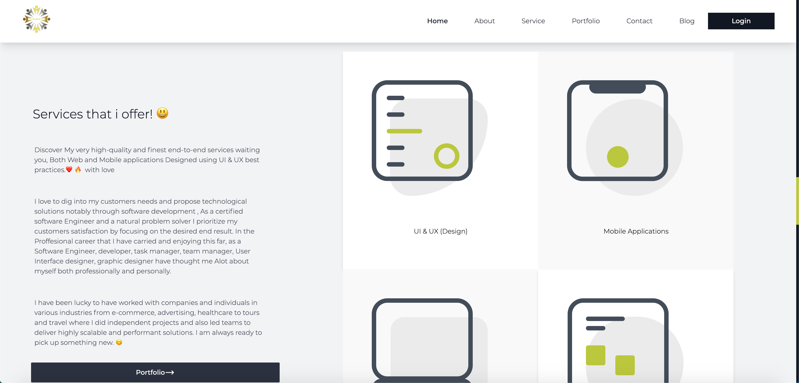

# Resume 😎🇷🇼 (React-version)

```
Progressive development of my resume (preview)
```



```
Using Amazing Technologies to make this even more interesting ⚙︎ 🔧
```


<!-- ## How to get access to the Docker Container/Image

- Go on [Dockerhub](https://hub.docker.com/) website, if you don't have an account, you will be asked to create one

- The image is accessible via this link **[fronted-Image](https://hub.docker.com/layers/138860314/pextech/dutygenfront/frontend/images/sha256-dbaa46cc1fd2355645d2aa474457a61a339441964521a9fd8bb2f381177318d5?context=explore)**

- To run the image locally run the following command to pull the image  `docker push pextech/dutygenfront:frontend`

- to start the image run `docker run -it -p 8080:80 --name frontend pextech/dutygenfront:frontend` -->


# Installation and Environment Setup ⚙︎ 

**Clone the repository from [Github](https://github.com/pextech/Resume-React.git).**

( You will need **Git** for this if you are running a Windows PC, Get it [HERE](https://git-scm.com/) )

```
git clone https://github.com/pextech/Resume-React.git
```

**To Install all dependencies:** 🔧

```
npm install
```


**Now to start the app:**

```
npm run start
```


# Tools used

- React **javascript UI library**
- Tailwind: **css**
- Redux: **State manager**
- Docker: **Image/Container**
- NGINX: **WEb container**

# More Tools

- ES6 Transpiler: **[Babel](babeljs.io)**
<!-- - Deployment: **[Heroku](https://www.heroku.com)** and **[Netlify](https://www.netlify.com/)** -->

- Deployment : **Github-Pages**
<!-- - link to the app: **[link](https://pextech.github.io/Front-end-dutygenerator/)** -->

# Contribute

If you ever have an idea on how you might help improve the app, you are welcome to contribute your changes to the repository, Just follow the steps below:

Assumming you have the repo cloned on your PC,

- Pull the latest changes from the remote repo by running:

```
git pull origin develop
```

NB: You need to be on the develop branch when you do this

- Create & switch to the new branch where you will add your changes by running:

```
git checkout -b `yournewbranchname`
```

- After adding your changes, commit and push them to create a pull request against the develop branch. I will review and merge them if they are helpful.


# Author 

` Pextech 😎🇷🇼 `

